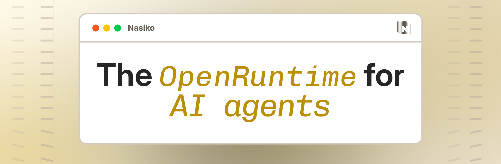

**Nasiko, the OpenRuntime for agents:** An open runtime for coding agents, harnesses, frameworks, and tools. Install the CLI and discover the agents already running on your machine, including Claude Code, Cursor, Codex, and OpenCode, all under a single cost model. Attribute spend across vendors in a single schema, route models at clean boundaries with a fail-open fallback, and control agent tool access through an MCP gateway. From your laptop to an entire estate, run your agents through the same runtime.

## Learn About Nasiko 🧑‍🎓

- Learn how to build with Nasiko through the [Nasiko Docs](https://docs.nasiko.com/) 📚
- Find tutorials and insights on Nasiko's services at [Nasiko's Blogs](https://www.nasiko.com/blogs) 📝
- View our livestreams and video content at the [Nasiko YouTube channel](https://www.youtube.com/@nasikolabs) 📺
- Discover our community-made projects and integrations at the [Nasiko repository](https://github.com/Nasiko-Labs/nasiko)

## Connect With Us 🫂

- Star 🌟 the [main Nasiko repo](https://github.com/Nasiko-Labs/nasiko) 🖥️
- Join our [Discord community](https://discord.gg/qhxEaFKwjU) 👨‍👩‍👧‍👦
- Follow us on [X](https://x.com/Nasikolabs) 🐤
- Apply to Nasiko through the [Nasiko Careers page (We're HIRING!)](https://www.nasiko.com/careers) 🧑‍💻
