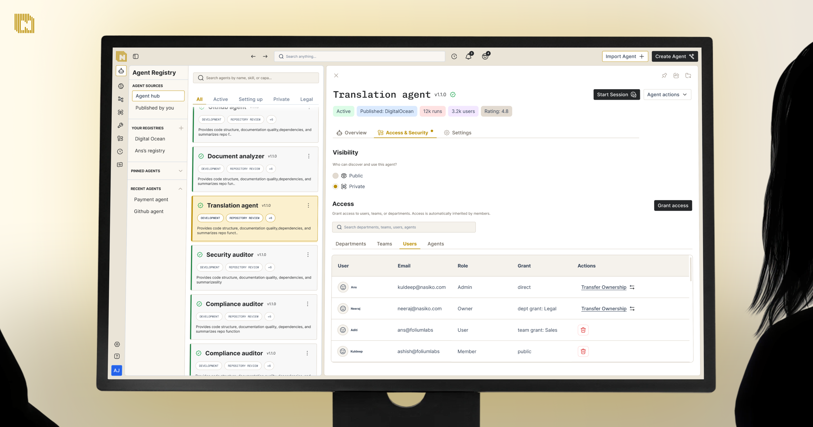

    
     
     
    <b>Nasiko is the OpenRuntime for agents, coding harnesses, frameworks and tools: Every other runtime is a destination — you move your agent into it, and you get visibility into whatever you moved. Nasiko is the opposite. Install the CLI and it discovers the coding agents already running on your machine — Claude Code, Cursor, Codex, OpenCode — and brings each one under a single cost model in one step.

From there you get spend attributed across vendors in one schema, model routing at clean boundaries with fail-open fallback, and an MCP gateway that decides which tools each agent can reach. The same command that runs on a laptop runs across an estate.</b>

<h2>Learn About Nasiko 🧑‍🎓</h2>

<ul>
    <li>Learn how to build with Nasiko through the <a href="http://docs.nasiko.com/intro">Nasiko Docs</a> 📚 </li>
    <li>Find tutorials and insights on Nasiko's services at <a href="https://app.daily.dev/squads/nasiko">Nasiko's Blogs</a> 📝</li>
    <li>View our livestreams and video content at the <a href="https://www.youtube.com/@nasikolabs">Nasiko YouTube channel</a> 📺</li>
    <li>Discover our community-made projects and integrations at the <a href="https://github.com/Nasiko-Labs/nasiko">Nasiko repository</a> 💻</li>
</ul>

 

<h2>Connect With Us 🫂</h2>
<ul>
    <li>Star 🌟 the <a href="https://github.com/Nasiko-Labs/nasiko/stargazers">main Nasiko repo</a> 🖥️</li>
    <li>Join our <a href="https://discord.gg/DTNPxhDjD">Discord community</a> 👨‍👩‍👧‍👦</li>
    <li>Follow us on <a href="https://x.com/Nasikolabs">X</a> 🐤</li>
    <li>Apply to Nasiko through the <a href="https://www.nasiko.com/careers">Nasiko Careers page (We're HIRING!)</a> 🧑‍💻</li>
</ul>
